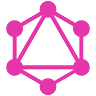
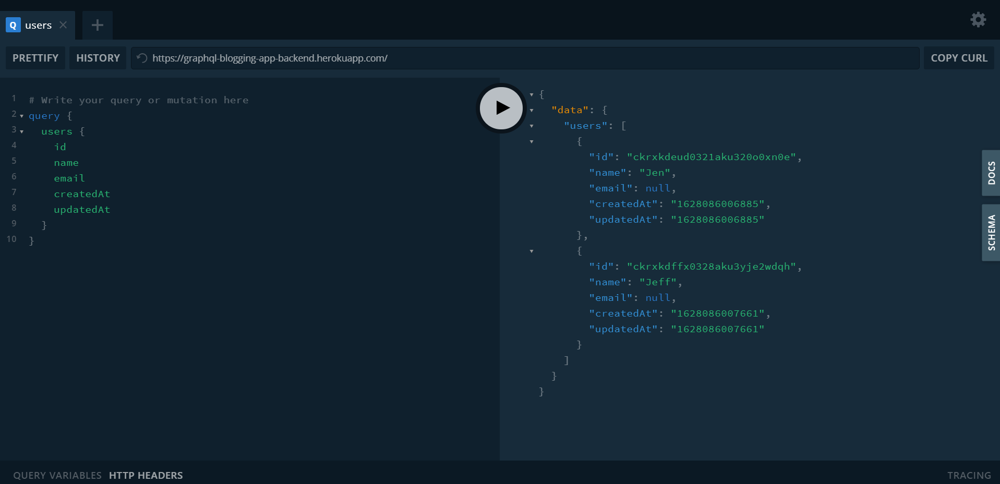
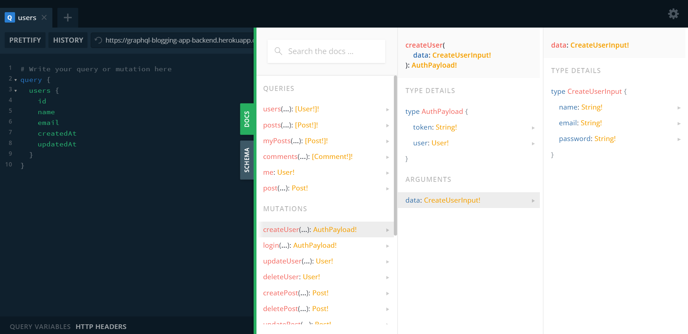

#  GraphQL Blogging App API

## [Try it here](https://graphql-blogging-app-backend.herokuapp.com/) 
**Note:** May take a few minutes to start due to Heroku need time to wake up

## Description
- GraphQL Blogging App API is GraphQL APIs of a simple blog application with only 3 entity `User`, `Post` and `Comment`.
- The main purpose of this API is to provide a simple example of GraphQL API for developers that interested in GraphQL and want to refer the GraphQL project structure.

## Technology
- Backend
  - Graphql-yoga - GraphQL Server.
  - Prisma 2 - Object-Relational Mapping
  - Babel - JavaScript compiler
  - Jsonwebtoken - Authentication

## Some preview images



## Available Scripts
Before jump in to run this application:
- First, go to `./config/dev.env` and replace `your_secret_key` with your secret key.
- Then create `.env` file in the root directory with content similar to `example.env` but replace `your_db_url` with your database url.

In the project directory, you can run:

## Install Dependencies
```
yarn install
```

### Compiles and hot-reloads for development
```
yarn dev
```

### Compiles and minifies for production
```
yarn heroku-postbuild
```

### Visualize Database with GUI
```
yarn visualize
```

# License & copyright

© Kirin Tran, FPT University TP.HCM
Licensed under the [MIT LICENSE](LICENSE).